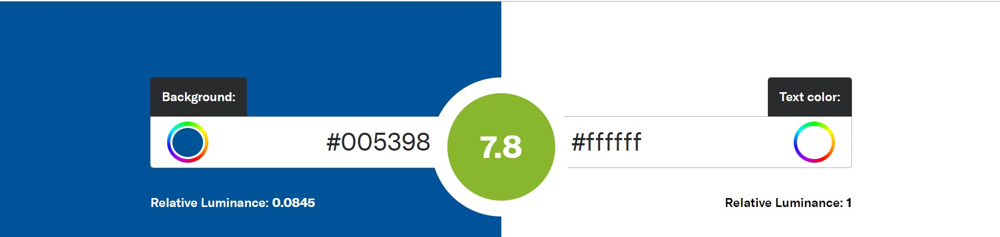

# Procesverslag
Markdown is een simpele manier om HTML te schrijven.  
Markdown cheat cheet: [Hulp bij het schrijven van Markdown](https://github.com/adam-p/markdown-here/wiki/Markdown-Cheatsheet).

Nb. De standaardstructuur en de spartaanse opmaak van de README.md zijn helemaal prima. Het gaat om de inhoud van je procesverslag. Besteedt de tijd voor pracht en praal aan je website.

Nb. Door *open* toe te voegen aan een *details* element kun je deze standaard open zetten. Fijn om dat steeds voor de relevante stuk(ken) te doen.

## Eva Burgering

  
uitwerken voor kick-off werkgroep

  ### Auteur:
  Eva Burgering

  #### Je startniveau:
   blauw

  #### Je focus:
  surface plane
 

## mijn website : Nijntje

  
uitwerken voor kick-off werkgroep

  ### Je opdracht:
  https://www.nijntje.nl/

  #### Screenshot(s) van de eerste pagina (small screen): 
  homepaige 
  

  #### Screenshot(s) van de tweede pagina (small screen):
  over nijntje  
  
 

## Toegankelijkheidstest 1/2 (week 1)

  
ik heb het kleurcontrast van de website getest, deze is van zichtzalf al erg goed.
 
 

  
   

   
  
  e werkgroep

  ### Bevindingen
  Lijst met je bevindingen die in de test naar voren kwamen:
  Ik heb het kleurcontrast van de tekst en de achtergrond getest, deze was al goed en hoeft dus niet veel aan te veranderd te worden. 
  Ik heb met de Colorblindly extention de website doorgelopen met alle opties , deze zijn: Trichromacy / Normal
Blue Cone Monochromacy / Achromatomaly
Monochromacy / Achromatopsia
Green-Weak / Deuteranomaly
Green-Blind / Deuteranopia
Red-Weak / Protanomaly
Red-Blind / Protanopia
Blue-Weak / Tritanomaly
Blue-Blind / Tritanopia.
Hieruit bleek dat doordat we website met felle primaire kleuren werkt in de illustraties maar het tektueel heel basic houd het met elk kleurbeperking nogsteeds een nette prikkelende website is. 

Tijdens het navigeren op de website merkte ik op dat er een automatische audio uitleg word gegeven als je over een iten hovert. Ik vind dit persoonlijk erg vervelend n zal dit zelf niet in mijn website doorzetten.

## Breakdownschets (week 1)

  
uitwerken na afloop 3e werkgroep

  ### de hele pagina: 
  

  ### dynamisch deel (bijv menu): 
  

## Voortgang 1 (week 2)

  
uitwerken voor 1e voortgang

  ### Stand van zaken
  Deze week probeerde ik een gallerij te maken op de homepaige van fotos. Het is me dankzij de figure tag en het gebruiken van flex wrap gelukt om do fotos aan elkaar te koppen en on der elkaar te zetten . Het lukt me alleen nog niet om deze met z'n e naast elkaar te zetten.... Ik zal een student assistent vragen om mij hier mee te helpen.

  ### Verslag van meeting
  hier na afloop snel de uitkomsten van de meeting vastleggen

-  er waren geen student assistenten aanwezig dus er was weinig tijd om feedback te krijgen, toch heb ik er veel aan gehad en kreeg ik duidelijke en snelle feedback waar tijd voor was.
  - figure tag was geen goeie aanpak en ga ik dus een oplossing voor vinden om het op een andere manier op te lossen

## Voortgang 2 (week 3)

  
uitwerken voor 2e voortgang

  ### Stand van zaken
  Na de feedback van afgelopen week weet ik dat ik op de homepagina het met de figure tag toch helemaal verkeerd had aangepakt. Ik heb het nu veranderd in een ul en dit is veel makkelijk om mee te werken als je grid wilt gebruiken. Ik merk dat ik het nog een beetje lastig vind om in te schatten wanneer ik wel of geen classes mag gebruiken. Zo min mogelijk uiteraard maar toch. Het maken van een werkend grid blijk ik toch wel een stuk lastiger te vinden dan ik dacht.Vis de code die ik nu heb zou het moeten werken maar dat doet het niet.

  Op de foto's hieronder kan je tot nu toe mijn prograssie zien van denwebsite.

  
  
  
  

  ### Verslag van meeting
  hier na afloop snel de uitkomsten van de meeting vastleggen

  - ik had mijn elementen verkeerd aangesproken in mn css, daarom werkte sommige delen helemaal niet.

## Toegankelijkheidstest 2/2 (week 4)

  
uitwerken na test in 9e werkgroep

  ### Bevindingen
Tijdens de toegangkelijkheidstest kwam ik er achter dat text die de schreanreader zou voorlezen bij de afbeeldingen een hele andere text was. Ik heb dus bij elke afbeelding die ik heb de Alt tag aangepast door een betere beschijving te geven zodat deze beter te begrijpen zijn . Ik dacht dat de title zou worden voorgelezen ipv de alt text

Ook heb ik mijn code voor de validator check gehaald en alle errors er uit gehaald. Op de foto hier onder staan de eroors die ik had en nu heb ik niks meer.

Ik heb voor de surface plane een dark mode gemaakt en daar vandaag het contrast op leesbaarheid voor gecheckt. Deze was ook helemaal goed.

  Lijst met je bevindingen die in de test naar voren kwamen (geef ook aan wat er verbeterd is):
  - Ik had een aantal errors in mijn code die zeker niet nodig waren. Heb deze allemaal weg gewerkt
  - Het contrast van mijn darkmode is prima
  - mijn title text voor de afbeeldingen moest ik ook naar de alt verplaatsen omdat ik er achter kwam dat die werd  voorgelezen met de screanreader ipv de title.

## Voortgang 3 (week 4)

  
uitwerken voor 3e voortgang

  ### Stand van zaken
  hier dit ging goed & dit was lastig (neem ook screenshots op van delen van je website en code)

Tijdens deze feedback kon ik niet aanwezig zijn ivm blaasontsteking. Ik heb mijn zwgaer gevraagd of hij naar mijn code wilde kijken of hij nog dingen zag die niet helemaal klopte. Hij vertelde mij dat ik opnieuw naar al mijn code moet kijken om alles netjes in te laten springen omdat het er erg rommelig uit zag. Dus dat ben ik gaan doen. Ook heeft hij mij geholpen met de laatste stappen van de darkmode te zetten wat mij niet helemaal lukte nog.

  ### Verslag van meeting
  hier na afloop snel de uitkomsten van de meeting vastleggen

  - code opnieuw doorlopen voor mooi te laten inspringen
  - darkmode afronden

## Eindgesprek (week 5)

  
uitwerken voor eindgesprek

  ### Je uitkomst - karakteristiek screenshots:
  
  
  De header komt pas tevoorschijn wanneer er een scroll plaatsvind en het logo van nijntje roteerd
  
  
   

  ### Dit ging goed/Heb ik geleerd: 
  Voor dat ik dit vak gevolgd had vond ik programeren nog verschrikkelijk en deed het het vorse tegenzin. Met het namaken van de nijntje website heb ik hier voor het eerst anders naar gekeken en heb ik het met pleizer gedaan. Ik vind het nogsteeds ongelovelijk moeilijk en het kost me nog heel veel tijd maar langzaam maar zeker begin in er wel voor op te warmen. Ik heb meer over coderen zelf geleerd en dat sommige dingen zoals 2nd child off en die dingen soms niet handig zijn als het onzeker is of in de website de content nog gaat veranderen , wat in veel gevallen wel zo is.

  Ik heb meer geleerd over het maken en gebruiken van een grid, het duurde wel even voordat ik het eenmaal onder de knie had maar ik ben heel blij met het resultaat.
  Korte omschrijving met plaatjes

Uitwerking van het grid
  

## Bronnenlijst

  
continu bijhouden terwijl je werkt

  Nb. Wees specifiek ('css-tricks' als bron is bijv. niet specifiek genoeg). 
  Nb. ChatGpT en andere AI horen er ook bij.
  Nb. Vermeld de bronnen ook in je code.

  1. screanreader only css code = bron: https://css-tricks.com/inclusively-hidden/e 
  2. Voor vrijwel alle Javascript code heb ik de hulp gekregen van mijn zwager Jordy die een opleiding voor programmeur aan het volgen is.
  3. Informatie over de opmaak en kleuren van bvb de buttons heb ik van https://www.nijntje.nl/
  4. Voor het uitschuifbare navigati menu heb ik Chatgpt geraagdpleegt en voor de opmaak elementen https://www.nijntje.nl/
  5. Door de darmode functie heb ik Chat Gpt geraadpleegt. Ik wilde dit graag met een checkbox doen zodat ik ook kon ondekken hoe die functie in zn werk gaat.
  6. Voor de footer en blockquote van mijn HTML pagina's heb ik de https://www.nijntje.nl/ geraadpleegt.
  7. Voor de zoom hover op de collage van mijn index pagina is dit de bron https://www.w3schools.com/howto/howto_css_zoom_hover.asp

